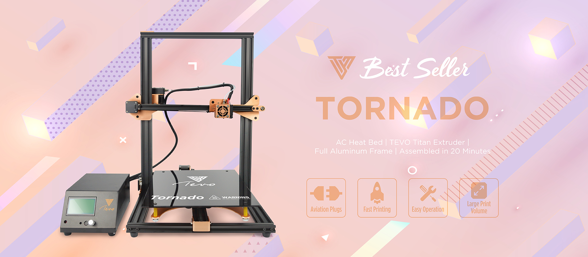

# Tevo Tornado 3D Printer

Welcome to the Github of the TEVO Tornado 3D printer - you find here the latest firmware & documents for your Tornado. Please take time and have detailed look at the infos provided on this page to be sure to update the correct firmware for your motherboard and version of 3d printer.

| Printer           | Tornado           |
| ----------------- |:-----------------:|
| Motherboard v1    | MKS Base          |
| Motherboard v2    | MKS Gen L         |
| Firmware          | Marlin            |
| Actual Version    | T-TO-X.XXXX       |

## Introduction 

## Identify TEVO Tornado Motherboard 

## What version of TEVO Tornado do I have? 

## Important Infos

## Update TEVO Tornado Firmware - Preparation

## Update TEVO Tornado Firmware - Download

## Update TEVO Tornado Firmware - Drivers

## Update TEVO Tornado Firmware - Arduino

## Update TEVO Tornado Firmware - Flash Motherboard

## Testing

## Additional links

- [TEVO Tornado Infos](https://www.tevo.cn/products/3d-printers/tevo-tornado/ "TEVO Tornado Infos")
- [TEVO Tornado FAQ](https://help.tevo.cn/faq-categories/tevo-tornado/ "TEVO Tornado FAQ")

- [TEVO Website](https://www.tevo.cn/ "Visit TEVO Website")
- [TEVO Support](https://help.tevo.cn/ "Visit TEVO Support Suite")

- [TEVO Official Webshop](https://tevo3dprinterstore.com "Visit TEVO Official Webshop")
- [TEVO Aliexpress Shop](https://tevo.aliexpress.com/store/2010004 "Visit TEVO Aliexpress Shop")
- [TEVO Amazon Store](https://www.amazon.com/stores/node/9447801011 " Visit TEVO Amazon Store")

